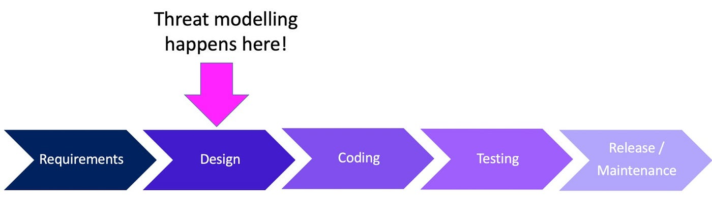
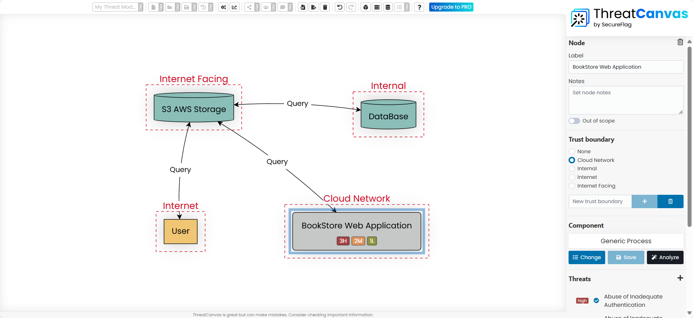

# Introduction to Threat Modeling with Threat Canvas - Practical Guide

## What is Threat Modeling?

Threat modeling is the process of identifying potential threats and vulnerabilities in a system **before attackers do**. It’s a **proactive** technique and ideally happens early in the Software Development Life Cycle (SDLC)—**specifically during the design phase**, whether you're following waterfall, Agile, or DevOps.

Threat modeling can be an internal process or provided as a service by security vendors.

 

---
## Objectives of Threat Modeling

- Guide developers, application owners, and project managers in understanding the current threats their application faces.
    
- Help track threats and document their corresponding mitigations—or whether the risk is accepted.
    
- Reduce expensive fixes later in the SDLC.
    
- Gain a **holistic view** of:
    
    - Components
        
    - Data flows
        
    - Trust boundaries
        
    - Associated threats
        
- Provide input to other AppSec activities (e.g., SAST, DAST, SCA).
    
---
## Components of a Threat Model (DFD)

The **Data Flow Diagram (DFD)** helps visualize the system and its security posture. It includes:

### Main Components:

| Component          | Description                                                                 |
| ------------------ | --------------------------------------------------------------------------- |
| **Entity**         | External users or systems interacting with your application                 |
| **Process**        | System functionalities (e.g., app logic, services)                          |
| **Data Store**     | Locations that store data (e.g., databases, S3, FTP servers)                |
| **Trust Boundary** | Points where the level of trust changes (e.g., internet-facing vs internal) |

Entities are often **threat actors**.  
Processes are **core services/functions** of the app.  
Data Stores include **databases, file storage, buckets, etc.**  
Trust Boundaries define **security zones**—knowing where these are is key to understanding exposure.

---
## Real-World Scenario: Bookstore Web Application

**You are a security architect** asked to perform threat modeling for a published bookstore app.

> **Scenario Brief (as delivered by the business):**  
> You are working as a security architect in a company and requested to do a threat model for a published bookstore application that uses an AWS S3 bucket as storage and stores data in an internal database.
> 
> The web application has registered users who are able to view and purchase books from the store via an online ordering service. Additionally, the application stores user photos in the S3 bucket.

### Step-by-Step DFD Setup (Using Threat Canvas Lite)

Threat Canvas Lite URL: https://www.threatcanvas.com/signup/index.html

>System Overview:
 >- **User** browses, logs in, and purchases books via a **web application**
>- Book data is stored in an **internal database**
>- User-uploaded photos are stored in an **AWS S3 bucket**
    
1. **Components**:
    
    - Entity: `User`
        
    - Process: `Bookstore Web Application`
        
    - Data Stores: `Database`, `S3 Bucket`
        
2. **Trust Boundaries**:
    
    - `User` → Internet
        
    - `Web App` → Internet-facing 
	    - Because it has a public IP address that can be accessed directly over the internet.
        
    - `Database` → Internal
        
    - `S3 Bucket` → Cloud Network
        
3. **Data Flows**:
	- Use **two-way relationships** for interactions like:
	    - User ↔ Web App → Named as “Query” or “Browsing” (bidirectional)
	    - Web App → Database (Query) 
	    - Web App → S3 Bucket (Query or Upload)
	    
    > In Threat Canvas, this is done by enabling the **toggle for bidirectional flow**, indicating both request and response occur.

	- Use **one-way relationships** for unidirectional data flow:
	    - For example, a **surveillance camera sending video to a server** is one-way—data flows in one direction only, with no response expected.

	    
4. **Threats (focused on the Web Application process)**:
    
    - Authentication flaws
        
    - Authorization issues
        
    - Privilege escalation
        
    - Clickjacking on payment pages
        
    - XSS (user-controlled HTML pages)
        
    - DoS (e.g., login lockout)
        
    - SQLi (in data queries)
        
    - Insufficient logging
        
    - Malicious file uploads
        

> After defining app functionality with stakeholders, use that to identify all possible misuse cases and related threats.

---

## After Drawing the DFD

Once the Data Flow Diagram (DFD) is complete and all relevant threats have been identified, the next step is to assess the current mitigation status for each threat.

- This requires **direct communication with developers or stakeholders** to determine the state of each security control.
    
- For every identified threat, you should record whether the corresponding control is:
    
    - **Already implemented**
        
    - **In progress**
        
    - **Not implemented at all**
        

Each threat entry should also include:

- A **risk rating** (e.g., Unspecified, Low, Medium, High)
    
- A **status** (Open, Mitigated, or Risk Accepted)
    
- A list of **recommended controls**, which may be generated by the tool (e.g., Threat Canvas) or defined manually
    

Once completed, you can generate and export a detailed PDF report from Threat Canvas that summarizes the diagram, threats, mitigation status, and recommendations.

---
### Example Output & Visual Reference

- This is the [PDF summary](attachments/My%20Threat%20Model.pdf) I have generated during this lesson

- The following screenshot from Threat Canvas Lite is included for quick reference and visual confirmation of the interface.

	

---
## Risk Threshold

Define a **risk threshold** to guide which issues must be addressed.

For example: if your threshold is “medium,” then any threat rated medium, high, or critical **must be mitigated**.