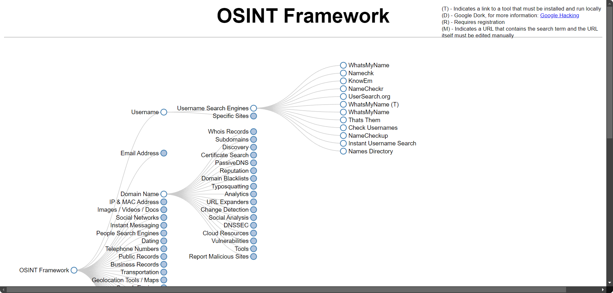

# How the Databases of Popular Websites Get Compromised?

### Causes include:
- **SQL Injection (SQLI)**
- **Phishing Emails**
- **NoSQL Databases**: For instance, MongoDB often comes without a password by default. If someone scans your site and finds the MongoDB port open, they can access your database.

### Useful Resources:
- **[Have I Been Pwned](https://haveibeenpwned.com/)**: 
	During Penetration Testing, you can search for leaks related to your email accounts findings. You might discover valid passwords!
- **[Shodan.io](https://www.shodan.io/)** 
	Scans IPv4 addresses globally. 
	- You can use it for example to find MongoDB/CouchDB databases without passwords. 
	- Use Shodan with an educational account for more search results. 
	- You can also scan with Nmap or zmap (zmap is faster). 
	- Tools like Robomongo can help you view the MongoDB with its IP from Shodan results.

---
# Exploiting Compromised Databases

### Useful OSINT Tools:
- **[OSINT Framework](https://osintframework.com/)**: Helps gather information from free tools or resources. It assists in finding free OSINT resources. Some sites may require registration or offer more data for a fee, but you should get at least a portion of the information for free.

- **[Pipl](https://pipl.com/)**: A provider of identity solutions.
- **[Pastebin](https://pastebin.com/)**: Known for publishing numerous leaks.

### Retrieving Original Passwords:
If you obtain a hashed password from a leak, you can use cmd5 site to retrieve the original password.  
[CMD5](https://cmd5.org/) Offers online MD5 / sha1/ MySQL / sha256 encryption and decryption services. It has a vast database with over ***90T data records***. Most services are free, with a small amount charged. It can also decrypt salted hashes in real-time. Established in 2006.

### Additional Tip:
Try any discovered password across all accessible applications, both public and internal.

More:
- Search for NoSQL vs SQL Databases.
- Search for IPv4 vs IPv6.
- Watch [OrwaGodFather Methodology](https://www.youtube.com/playlist?list=PLiLvsecrejRhQ7lOGgZSga47Jwhf5YXwD).
