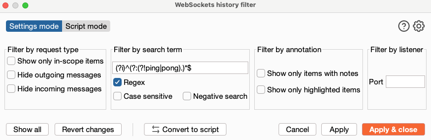

- If a WebSocket feature is present in the target application, analyze the requests that appear in the interception proxy, along with both the inline JavaScript inside the related HTML pages and the external JS files. This helps determine how the WebSocket connection is created, what parameters it relies on, and whether the handshake includes any CSRF protection. If the handshake is not properly secured, a malicious proof‑of‑concept script executed in the victim’s browser can establish a WebSocket connection to the target server on the victim’s behalf using their authenticated session. This allows the script to perform any WebSocket actions permitted to the victim account.

- Use this regex in Burp’s WebSocket History **Filter by search term** field and click on **Regex** to hide all PING/PONG messages:

	``` js
	(?i)^(?:(?!ping|pong).)*$
 	```
	
	


